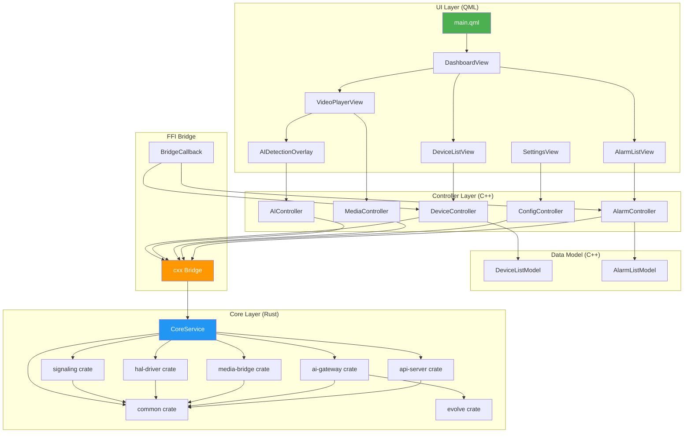
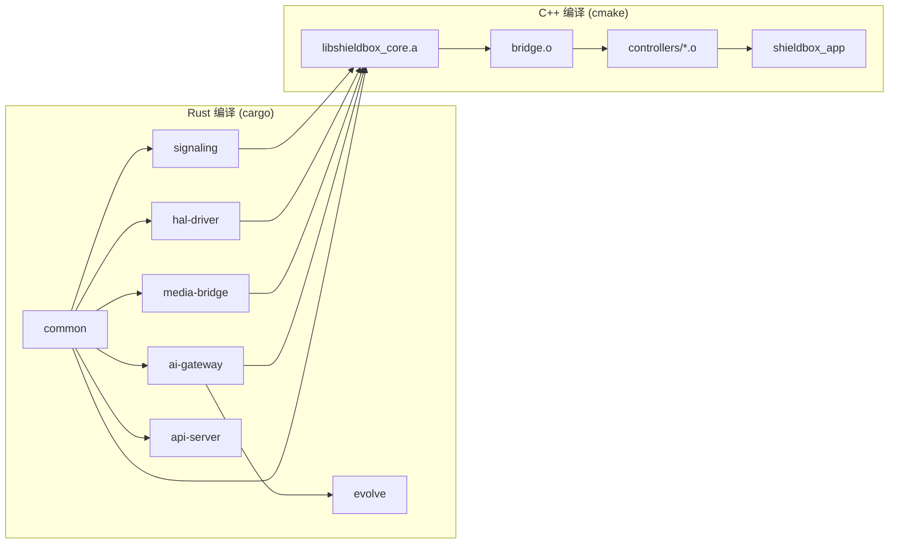

# 内置应用 (Built-in App) 系统架构设计文档

> **版本**: v1.0  
> **日期**: 2025-01-20  
> **状态**: 设计评审  
> **作者**: ShieldBox AI Team  
> **关联**: ARCHITECTURE_v6.2.md / hal_design.md / signaling/src/lib.rs

---

## 1. 概述与设计目标

### 1.1 背景

ShieldBox 内置应用是运行在边缘网关盒子上的本地化应用系统，提供视频监控、AI 推理、本地管理和云端同步等功能。本设计文档定义内置应用的分层架构、模块间通信机制及文件目录结构规范。

内置应用运行在边缘设备（Sophon BM1684X / NVIDIA Jetson / Rockchip RK3588 等）上，通过 Rust Core 层直接调用后端 crates 提供的信令、HAL、AI 等底层能力，并通过 C++ Controller 层和 QML UI 层为用户提供本地交互界面。

### 1.2 设计目标

| # | 目标 | 验收标准 |
|---|------|---------|
| G1 | **三层解耦** | UI层(QML/Widgets)、业务逻辑层(C++ Controller)、数据层(Rust Core) 明确分离 |
| G2 | **高性能通信** | 信号槽 + Rust FFI Bridge 实现跨语言高效通信 |
| G3 | **可维护性** | 清晰的目录结构，按模块划分，便于团队协作 |
| G4 | **可扩展性** | 新增功能只需在对应层级添加模块，不影响其他层 |
| G5 | **零拷贝数据传递** | 设备帧图像通过共享内存传递，避免序列化开销 |

### 1.3 设计原则

| 原则 | 说明 |
|------|------|
| **单向依赖** | 上层依赖下层，禁止反向依赖；Core 层不感知 UI/Controller |
| **接口隔离 (ISP)** | Controller 通过 cxx bridge 接口调用 Rust，不暴露内部实现 |
| **开闭原则 (OCP)** | 新增功能只添加模块，不修改已有代码 |
| **错误边界** | 每层有独立错误处理策略，FFI 层统一错误传播 |

---

## 2. 术语表

| 术语 | 定义 |
|------|------|
| **UI层** | QML/Widgets 表现层，负责用户界面渲染和交互 |
| **Controller层** | C++ 业务逻辑层，处理 UI 事件并调用 Rust FFI |
| **Core层** | Rust 核心数据层，提供底层服务实现 |
| **Rust FFI Bridge** | Rust 与 C++ 之间的 Foreign Function Interface 桥接层（基于 cxx） |
| **Signal/Slot** | Qt 信号槽机制，用于 UI 与 Controller 间异步通信 |
| **SignalingManager** | Rust 信令管理器，统一调度五协议（GB28181/ONVIF/RTSP/RTMP/EHOME） |
| **ProtocolAdapter** | Rust 协议适配器 trait，各协议实现此 trait 即可接入 |
| **HALManager** | 硬件抽象层管理器，管理多 Driver + 多 Accelerator 的生命周期 |

---

## 3. 分层架构

### 3.1 整体架构图

```
┌─────────────────────────────────────────────────────────────────────┐
│                        UI Layer (表现层)                             │
│  ┌─────────────┐  ┌─────────────┐  ┌─────────────┐  ┌─────────────┐ │
│  │   QML UI    │  │  Widgets    │  │   Dialog    │  │   Charts    │ │
│  │  (QML/C++)  │  │ (C++ Qt)    │  │ (C++ Qt)    │  │ (QML/C++)   │ │
│  └──────┬──────┘  └──────┬──────┘  └──────┬──────┘  └──────┬──────┘ │
│         │                │                │                │        │
│         └────────────────┴────────────────┴────────────────┘        │
│                              │ (Signal/Slot)                         │
├──────────────────────────────┼──────────────────────────────────────┤
│              Controller Layer (业务逻辑层 - C++)                      │
│  ┌─────────────┐  ┌─────────────┐  ┌─────────────┐  ┌─────────────┐ │
│  │  Device     │  │   AI        │  │   Media     │  │   Config    │ │
│  │  Controller │  │  Controller │  │  Controller │  │  Controller │ │
│  └──────┬──────┘  └──────┬──────┘  └──────┬──────┘  └──────┬──────┘ │
│         │                │                │                │        │
│         └────────────────┴────────────────┴────────────────┘        │
│                              │ (Rust FFI Bridge)                      │
├──────────────────────────────┼──────────────────────────────────────┤
│                        Core Layer (核心数据层 - Rust)                 │
│  ┌─────────────┐  ┌─────────────┐  ┌─────────────┐  ┌─────────────┐ │
│  │  Signaling  │  │   HAL       │  │   Media     │  │   AI        │ │
│  │  Service    │  │   Driver    │  │   Bridge    │  │  Gateway    │ │
│  ├─────────────┤  ├─────────────┤  ├─────────────┤  ├─────────────┤ │
│  │  API Server │  │  Evolve     │  │  Common     │  │  Memory/IoT │ │
│  └─────────────┘  └─────────────┘  └─────────────┘  └─────────────┘ │
└─────────────────────────────────────────────────────────────────────┘
```

### 3.2 分层职责

| 层级 | 技术栈 | 职责范围 |
|------|--------|---------|
| **UI Layer** | QML + Qt Widgets | 用户界面渲染、交互响应、动画效果、数据绑定 |
| **Controller Layer** | C++ (Qt) | 业务逻辑处理、UI 状态管理、FFI 调用、线程调度 |
| **Core Layer** | Rust (Tokio) | 底层服务实现、数据持久化、硬件抽象、信令管理 |

### 3.3 层间依赖规则

```
UI Layer    → Controller Layer (单向依赖，通过 Signal/Slot)
Controller  → Core Layer       (单向依赖，通过 FFI Bridge)
Core Layer  → UI/Controller    (禁止反向依赖)

同一层内部:
  Controller 之间可以相互引用（通过 Signal/Slot 解耦）
  Core 模块之间通过 Arc<RwLock<T>> 共享状态
```

### 3.4 线程模型

```
┌─────────────────────────────────────────────────────────────┐
│                    Thread Architecture                       │
├─────────────────────────────────────────────────────────────┤
│                                                             │
│  Qt Main Thread ──── UI 渲染 + Signal/Slot 分发            │
│       │                                                     │
│       ├── Qt Worker Thread ─── Controller 异步任务          │
│       │       │                                             │
│       │       └── FFI Sync Call ─── Rust Core 同步调用      │
│       │                                                     │
│  Tokio Runtime Thread Pool ──── Rust Core 异步任务          │
│       │                                                     │
│       ├── SignalingManager ── 信令事件循环                  │
│       ├── HAL Task ────────── 硬件 DMA 操作                 │
│       └── Media Task ──────── 流媒体编解码                  │
│                                                             │
│  Shared: Arc<RwLock<T>> ──── 跨线程安全共享数据             │
└─────────────────────────────────────────────────────────────┘
```

---

## 4. 模块间通信机制

### 4.1 通信总览

```
┌──────────────────────────────────────────────────────────────────┐
│                     Communication Architecture                    │
├──────────────────────────────────────────────────────────────────┤
│                                                                  │
│   UI (QML)  ←─────→  Controller (C++)  ←─────→  Core (Rust)     │
│      │                    │                      │               │
│   Signal/Slot          cxx FFI               Tokio Async        │
│   (异步解耦)          (同步桥接)             (并发安全)           │
│                                                                  │
└──────────────────────────────────────────────────────────────────┘
```

### 4.2 信号槽机制 (UI ↔ Controller)

信号槽是 Qt 框架的核心通信机制，实现 UI 与 Controller 之间的松耦合。Controller 继承 `QObject`，通过 `Q_PROPERTY` 暴露属性给 QML，通过 `Q_INVOKABLE` 暴露方法，通过 `signals` 推送状态变更。

```cpp
// ── DeviceController.h ──
#pragma once
#include <QObject>
#include <QVariantList>

class DeviceController : public QObject {
    Q_OBJECT
    Q_PROPERTY(QVariantList devices READ devices NOTIFY devicesUpdated)
    Q_PROPERTY(bool loading READ loading NOTIFY loadingChanged)

public:
    explicit DeviceController(QObject* parent = nullptr);

    Q_INVOKABLE void refreshDevices();
    Q_INVOKABLE void startStream(const QString& deviceId, const QString& channelId);
    Q_INVOKABLE void stopStream(const QString& sessionId);
    Q_INVOKABLE void ptzControl(const QString& deviceId,
                                const QString& command,
                                float speed);

    QVariantList devices() const;
    bool loading() const;

signals:
    void devicesUpdated(const QVariantList& devices);
    void streamStarted(const QString& deviceId, const QString& sessionId);
    void streamStopped(const QString& sessionId);
    void errorOccurred(const QString& code, const QString& message);
    void loadingChanged();

private:
    QVariantList m_devices;
    bool m_loading = false;
};
```

QML 端使用示例：

```qml
// DeviceListView.qml
import QtQuick 2.15
import QtQuick.Controls 2.15

ListView {
    id: deviceList
    model: deviceController.devices

    delegate: ItemDelegate {
        text: modelData.device_name
        onClicked: deviceController.startStream(modelData.device_id, "0")
    }

    Connections {
        target: deviceController
        function onDevicesUpdated(devices) {
            // model 自动通过 Q_PROPERTY 绑定更新
        }
        function onErrorOccurred(code, message) {
            errorDialog.show(code, message)
        }
    }

    Component.onCompleted: deviceController.refreshDevices()
}
```

### 4.3 Rust FFI Bridge (Controller ↔ Core)

#### 4.3.1 桥接架构

使用 [cxx](https://cxx.rs/) 库实现 Rust 与 C++ 之间的安全桥接。cxx 在编译期保证类型安全，避免手写 `extern "C"` 的常见错误。

```
┌─────────────────────┐         ┌─────────────────────┐
│   C++ Controller     │  cxx    │   Rust Core          │
│                     │◄───────►│                      │
│  #include "bridge.h"│         │  use crate::ffi;     │
│                     │         │                      │
│  shieldbox::ffi::   │         │  #[cxx::bridge]      │
│    discover_devices()│        │  mod ffi { ... }     │
│    start_stream()   │         │                      │
│    detect_objects() │         │  → signaling crate   │
│    get_config()     │         │  → hal-driver crate  │
│                     │         │  → media-bridge      │
└─────────────────────┘         └─────────────────────┘
```

#### 4.3.2 桥接接口定义

```rust
// ── core/src/ffi.rs ──
//! cxx FFI Bridge — C++ Controller 调用 Rust Core 的安全接口
//!
//! 设计原则:
//!   1. 所有跨语言调用通过此文件定义
//!   2. 只暴露业务需要的方法，不暴露内部实现
//!   3. 异步操作通过回调模式桥接（Rust tokio → C++ callback）

#[cxx::bridge]
mod ffi {
    // ========================================================================
    // 共享数据结构（cxx 自动生成 C++ 绑定）
    // ========================================================================

    /// 设备信息（映射 signaling::types::UnifiedDeviceInfo）
    struct DeviceInfo {
        device_id: String,
        device_name: String,
        protocol: String,       // "GB28181" / "ONVIF" / "RTSP" / ...
        status: String,         // "Online" / "Offline" / "Degraded"
        ip_address: String,
        port: u16,
        channel_count: u32,
        manufacturer: String,
    }

    /// 流会话信息
    struct StreamSessionInfo {
        session_id: String,
        device_id: String,
        channel_id: String,
        stream_url: String,
        codec: String,
        width: u32,
        height: u32,
        fps: u8,
    }

    /// AI 检测结果
    struct Detection {
        class_name: String,
        confidence: f32,
        x1: f32,
        y1: f32,
        x2: f32,
        y2: f32,
    }

    /// 告警信息
    struct AlarmInfo {
        alarm_id: String,
        device_id: String,
        alarm_type: String,
        severity: String,       // "Critical" / "Warning" / "Info"
        message: String,
        timestamp_ms: i64,
        image_data: Vec<u8>,    // 告警抓图 JPEG
    }

    // ========================================================================
    // Core → Controller 回调（Rust 通知 C++ 状态变更）
    // ========================================================================

    extern "C++" {
        include!("bridge_callback.h");
        type BridgeCallback;

        /// 设备状态变更通知
        fn on_device_status_changed(self: &BridgeCallback,
                                    device_id: &str, status: &str);
        /// 新告警通知
        fn on_alarm_received(self: &BridgeCallback, alarm: AlarmInfo);
        /// 流状态变更通知
        fn on_stream_status_changed(self: &BridgeCallback,
                                    session_id: &str, status: &str);
    }

    // ========================================================================
    // Controller → Core 方法（C++ 调用 Rust）
    // ========================================================================

    extern "Rust" {
        /// 初始化 Core 层（必须在所有调用之前执行）
        fn core_initialize(config_json: &str) -> Result<()>;

        /// 关闭 Core 层，释放所有资源
        fn core_shutdown() -> Result<()>;

        // ── 设备管理 ──
        fn discover_devices() -> Result<Vec<DeviceInfo>>;
        fn list_devices() -> Result<Vec<DeviceInfo>>;
        fn get_device(device_id: &str) -> Result<DeviceInfo>;
        fn start_stream(device_id: &str, channel_id: &str) -> Result<StreamSessionInfo>;
        fn stop_stream(session_id: &str) -> Result<()>;
        fn ptz_control(device_id: &str, command: &str, speed: f32) -> Result<()>;
        fn snapshot(device_id: &str, channel_id: &str) -> Result<Vec<u8>>;

        // ── AI 推理 ──
        fn detect_objects(image_data: &[u8], width: u32, height: u32,
                          model_path: &str) -> Result<Vec<Detection>>;

        // ── 配置管理 ──
        fn get_config(key: &str) -> Result<String>;
        fn set_config(key: &str, value: &str) -> Result<()>;

        // ── 告警管理 ──
        fn list_alarms(limit: u32) -> Result<Vec<AlarmInfo>>;
        fn acknowledge_alarm(alarm_id: &str) -> Result<()>;

        // ── 注册回调 ──
        fn register_callback(callback: UniquePtr<BridgeCallback>);
    }
}
```

#### 4.3.3 桥接实现（Rust 端）

```rust
// ── core/src/ffi_impl.rs ──
//! FFI 接口的 Rust 实现
//! 将 cxx bridge 方法转发到实际的 Rust crate 服务

use crate::ffi;
use std::sync::Arc;
use tokio::sync::RwLock;
use once_cell::sync::Lazy;

/// 全局 Core 服务实例
static CORE: Lazy<Arc<CoreService>> = Lazy::new(|| {
    Arc::new(CoreService::new())
});

/// Core 服务聚合
pub struct CoreService {
    signaling: Arc<RwLock<signaling::SignalingManager>>,
    hal: Arc<RwLock<hal_driver::HALManager>>,
    callback: RwLock<Option<cxx::UniquePtr<ffi::BridgeCallback>>>,
}

impl CoreService {
    fn new() -> Self {
        Self {
            signaling: Arc::new(RwLock::new(signaling::SignalingManager::new())),
            hal: Arc::new(RwLock::new(hal_driver::HALManager::new())),
            callback: RwLock::new(None),
        }
    }
}

// FFI 导出函数实现
pub fn core_initialize(config_json: &str) -> Result<(), cxx::Exception> {
    // 解析配置，初始化信令管理器、HAL 等
    // 启动 tokio runtime（如果尚未启动）
    Ok(())
}

pub fn discover_devices() -> Result<Vec<ffi::DeviceInfo>, cxx::Exception> {
    // 同步桥接：在 tokio runtime 上 block_on 异步操作
    let rt = tokio::runtime::Handle::current();
    let signaling = CORE.signaling.clone();
    
    let result = rt.block_on(async {
        let mut mgr = signaling.write().await;
        mgr.discover_all().await
    });
    
    result.map(|devices| {
        devices.into_iter().map(|d| ffi::DeviceInfo {
            device_id: d.device_id,
            device_name: d.device_name,
            protocol: d.protocol.to_string(),
            status: format!("{:?}", d.status),
            ip_address: d.ip_address,
            port: d.port,
            channel_count: d.channels.len() as u32,
            manufacturer: d.manufacturer.unwrap_or_default(),
        }).collect()
    }).map_err(|e| cxx::Exception(e.to_string()))
}

pub fn start_stream(device_id: &str, channel_id: &str)
    -> Result<ffi::StreamSessionInfo, cxx::Exception>
{
    let rt = tokio::runtime::Handle::current();
    let signaling = CORE.signaling.clone();
    
    let result = rt.block_on(async {
        let mgr = signaling.read().await;
        mgr.start_stream(device_id, channel_id).await
    });
    
    result.map(|session| ffi::StreamSessionInfo {
        session_id: session.session_id,
        device_id: session.device_id,
        channel_id: session.channel_id,
        stream_url: session.stream_url.unwrap_or_default(),
        codec: format!("{:?}", session.codec),
        width: session.width,
        height: session.height,
        fps: session.fps,
    }).map_err(|e| cxx::Exception(e.to_string()))
}
```

#### 4.3.4 桥接回调（C++ 端）

```cpp
// ── bridge_callback.h ──
#pragma once
#include <QObject>
#include <string>
#include <memory>

/// Cxx 回调对象 — Rust Core 通过此对象向 C++ Controller 推送事件
class BridgeCallback {
public:
    virtual ~BridgeCallback() = default;

    /// 设备状态变更
    virtual void on_device_status_changed(const std::string& device_id,
                                          const std::string& status) = 0;
    /// 新告警
    virtual void on_alarm_received(AlarmInfo alarm) = 0;
    /// 流状态变更
    virtual void on_stream_status_changed(const std::string& session_id,
                                          const std::string& status) = 0;
};

/// 桥接回调适配器 — 将 cxx 回调转发为 Qt 信号
class BridgeCallbackAdapter : public BridgeCallback, public QObject {
    Q_OBJECT
public:
    void on_device_status_changed(const std::string& device_id,
                                  const std::string& status) override {
        emit deviceStatusChanged(
            QString::fromStdString(device_id),
            QString::fromStdString(status));
    }

    void on_alarm_received(AlarmInfo alarm) override {
        emit alarmReceived(/* 转换为 QVariantMap */);
    }

    void on_stream_status_changed(const std::string& session_id,
                                  const std::string& status) override {
        emit streamStatusChanged(
            QString::fromStdString(session_id),
            QString::fromStdString(status));
    }

signals:
    void deviceStatusChanged(const QString& deviceId, const QString& status);
    void alarmReceived(const QVariantMap& alarm);
    void streamStatusChanged(const QString& sessionId, const QString& status);
};
```

#### 4.3.5 类型映射表

| Rust 类型 | C++ 类型 | 说明 |
|-----------|----------|------|
| `i32` | `int32_t` | 整数 |
| `u32` | `uint32_t` | 无符号整数 |
| `i64` | `int64_t` | 时间戳（毫秒） |
| `f32` / `f64` | `float` / `double` | 浮点数 |
| `String` | `std::string` | UTF-8 字符串 |
| `&str` | `const std::string&` | 字符串引用 |
| `Vec<T>` | `std::vector<T>` | 动态数组 |
| `Vec<u8>` | `std::vector<uint8_t>` | 字节数组（图像数据） |
| `&[u8]` | `const std::vector<uint8_t>&` | 字节数组引用 |
| `Result<T, E>` | 抛出 `cxx::Exception` | 错误传播 |
| `UniquePtr<T>` | `std::unique_ptr<T>` | 所有权转移 |

---

## 5. 端到端数据流

### 5.1 设备发现流程

```
┌────────┐    Signal/Slot    ┌──────────────┐    cxx FFI     ┌──────────────────┐
│  QML   │ ──────────────►  │  Device      │ ─────────────► │  SignalingManager│
│  UI    │  refreshDevices() │  Controller  │  discover_     │  (Rust)          │
│        │                   │  (C++)       │  devices()     │                  │
│        │ ◄────────────── │              │ ◄───────────── │  ┌──────────────┐│
│        │  devicesUpdated   │              │  Vec<DeviceInfo>│  │ProtocolAdapter││
│        │  (QVariantList)   │              │                │  │ GB28181/ONVIF ││
│        │                   │              │                │  │ RTSP/RTMP/... ││
└────────┘                   └──────────────┘                └──┴──────────────┘┘
```

**详细步骤**：

1. 用户点击"刷新设备"按钮
2. QML 调用 `deviceController.refreshDevices()`
3. Controller 通过 FFI 调用 `discover_devices()`
4. Rust Core 的 `SignalingManager` 遍历所有已注册的 `ProtocolAdapter`，调用各自的 `discover_devices()` 方法
5. 各协议适配器（GB28181/ONVIF/RTSP...）执行设备发现
6. 汇总结果转换为 `Vec<DeviceInfo>` 返回给 C++
7. Controller 发射 `devicesUpdated` 信号
8. QML 通过 `Connections` 接收信号，更新 ListView

### 5.2 实时拉流 + AI 分析流程

```
┌────────┐              ┌──────────────┐             ┌──────────────────┐
│  QML   │  startStream │  Device      │  start_     │  SignalingManager│
│  Video │ ────────────►│  Controller  │  stream()   │  (Rust)          │
│ Player │              │  (C++)       │ ──────────► │                  │
│        │              │              │             │  返回 StreamURL   │
│        │ ◄────────────│              │ ◄────────── │                  │
│  播放   │ streamStarted│              │             └──────────────────┘
│  RTSP   │              │              │
│  流     │              │              │  detect_objects()
│        │ ────────────►│              │ ──────────► ┌──────────────────┐
│  帧回调 │              │  AI          │             │  AI Gateway      │
│ ◄──────│              │  Controller  │ ◄────────── │  (Rust)          │
│        │              │              │ Detection[] │  HAL Accelerator │
│  渲染   │              │              │             └──────────────────┘
│  检测框 │              │              │
└────────┘              └──────────────┘
```

### 5.3 告警推送流程（Core → UI）

```
┌──────────────────┐   callback    ┌──────────────┐  Signal/Slot  ┌────────┐
│  SignalingManager│ ─────────────►│  Bridge      │ ─────────────►│  QML   │
│  (Rust)          │  on_alarm_    │  Callback    │  alarmReceived│  Alarm │
│                  │  received()   │  Adapter     │               │  View  │
│  AI 检测到异常    │              │  (C++)       │               │        │
│  生成告警         │              │  → Qt Signal │               │  弹窗   │
└──────────────────┘              └──────────────┘               └────────┘
```

---

## 6. 文件目录结构规范

### 6.1 整体目录结构

```
clients/built-in-app/
├── app/                              # 内置应用主程序
│   ├── main.cpp                      # 应用入口（QML 引擎初始化 + Core 初始化）
│   ├── main.qml                      # QML 主界面（NavigationStack）
│   └── qml.qrc                       # QML 资源文件
│
├── src/                              # C++ 源码
│   ├── controllers/                  # 控制器层（业务逻辑）
│   │   ├── DeviceController.h        # 设备管理控制器
│   │   ├── DeviceController.cpp
│   │   ├── AIController.h            # AI 推理控制器
│   │   ├── AIController.cpp
│   │   ├── MediaController.h         # 媒体流控制器
│   │   ├── MediaController.cpp
│   │   ├── ConfigController.h        # 配置管理控制器
│   │   ├── ConfigController.cpp
│   │   ├── AlarmController.h         # 告警控制器
│   │   └── AlarmController.cpp
│   │
│   ├── models/                       # 数据模型（QAbstractListModel）
│   │   ├── DeviceListModel.h         # 设备列表模型
│   │   ├── DeviceListModel.cpp
│   │   ├── AlarmListModel.h          # 告警列表模型
│   │   └── AlarmListModel.cpp
│   │
│   ├── views/                        # QML 视图组件
│   │   ├── DashboardView.qml         # 主控台
│   │   ├── DeviceListView.qml        # 设备列表
│   │   ├── VideoPlayerView.qml       # 视频播放
│   │   ├── AIDetectionOverlay.qml    # AI 检测叠加层
│   │   ├── AlarmListView.qml         # 告警列表
│   │   ├── SettingsView.qml          # 系统设置
│   │   └── components/               # 可复用组件
│   │       ├── StatusIndicator.qml
│   │       ├── VideoTile.qml
│   │       └── AlarmBadge.qml
│   │
│   ├── bridge/                       # FFI 桥接层
│   │   ├── bridge_callback.h         # cxx 回调接口定义
│   │   ├── bridge_callback.cpp
│   │   └── bridge_utils.h            # 类型转换工具
│   │
│   └── utils/                        # 工具类
│       ├── Logger.h                  # 日志工具（对接 spdlog）
│       └── ThemeConfig.h             # 主题配置
│
├── core/                             # Rust Core 层（编译为静态库 libshieldbox_core.a）
│   ├── Cargo.toml                    # Rust 依赖配置
│   ├── build.rs                      # cxx 代码生成脚本
│   ├── src/
│   │   ├── lib.rs                    # Core 入口（导出 FFI 函数）
│   │   ├── ffi.rs                    # cxx bridge 定义（#[cxx::bridge]）
│   │   ├── ffi_impl.rs              # cxx bridge 实现
│   │   ├── service.rs               # CoreService 聚合
│   │   └── error.rs                 # Core 错误类型
│   └── tests/
│       └── bridge_test.rs            # FFI 集成测试
│
├── docs/                             # 文档目录
│   ├── architecture.md               # 本文档
│   └── api_reference.md              # API 参考
│
├── tests/                            # 测试目录
│   ├── test_controllers/             # Controller 单元测试
│   └── test_integration/             # 端到端集成测试
│
├── resources/                        # 静态资源
│   ├── icons/                        # 图标
│   ├── fonts/                        # 字体
│   └── translations/                 # 国际化翻译
│       ├── zh_CN.ts
│       └── en_US.ts
│
├── CMakeLists.txt                    # CMake 主构建配置
└── README.md                         # 项目说明
```

### 6.2 目录职责说明

| 目录 | 语言 | 职责 |
|------|------|------|
| `app/` | C++/QML | 应用入口和 QML 资源注册 |
| `src/controllers/` | C++ | 业务逻辑控制器，对接 QML 和 FFI |
| `src/models/` | C++ | Qt 数据模型，供 QML ListView/GridView 绑定 |
| `src/views/` | QML | 界面视图，纯声明式 UI |
| `src/views/components/` | QML | 可复用 UI 组件 |
| `src/bridge/` | C++ | FFI 回调和类型转换 |
| `src/utils/` | C++ | 工具类 |
| `core/` | Rust | Core 层源码，编译为静态库 |
| `core/src/ffi.rs` | Rust | cxx bridge 接口定义（核心） |
| `core/src/ffi_impl.rs` | Rust | bridge 接口的 Rust 实现 |
| `resources/` | - | 图标、字体、国际化文件 |

---

## 7. 模块依赖关系图

### 7.1 Mermaid 依赖关系图



### 7.2 编译依赖图



### 7.3 Crate 依赖对照表

| Rust Crate | 路径 | 职责 | 对应 Controller |
|-----------|------|------|----------------|
| `signaling` | `src/backend/crates/signaling/` | GB28181/ONVIF/RTSP/RTMP/EHOME 五协议信令管理 | DeviceController, MediaController |
| `hal-driver` | `src/backend/crates/hal-driver/` | 硬件抽象层（算能/海康/NVIDIA/RK） | AIController |
| `media-bridge` | `src/backend/crates/media-bridge/` | ZLMediaKit 流媒体调度 | MediaController |
| `ai-gateway` | `src/backend/crates/ai-gateway/` | AI 算法框架 & 多模态大模型网关 | AIController |
| `api-server` | `src/backend/crates/api-server/` | RESTful API 服务（Actix-web） | ConfigController |
| `common` | `src/backend/crates/common/` | 公共类型、错误处理 | 所有 Controller |
| `evolve` | `src/backend/crates/evolve/` | AI 自进化多智能体系统 | AIController |

---

## 8. 错误处理策略

### 8.1 跨层错误传播

```
┌──────────────────────────────────────────────────────────────┐
│                    Error Handling Strategy                    │
├──────────────────────────────────────────────────────────────┤
│                                                              │
│  Rust Core                                                   │
│  ├── SignalingError / ModuleError → 转换为 String            │
│  └── Result<T, E> → cxx::Exception (自动传播到 C++)          │
│                                                              │
│  C++ Controller                                              │
│  ├── cxx::Exception → catch → emit errorOccurred() signal    │
│  └── Q_INVOKABLE 方法内部 try/catch 包裹                     │
│                                                              │
│  QML UI                                                      │
│  └── Connections → onErrorOccurred(code, message) → 显示     │
│                                                              │
└──────────────────────────────────────────────────────────────┘
```

### 8.2 Controller 错误处理模板

```cpp
void DeviceController::refreshDevices() {
    setLoading(true);
    
    // 在工作线程执行 FFI 调用
    QtConcurrent::run([this]() {
        try {
            auto devices = shieldbox::ffi::discover_devices();
            
            // 切回主线程发射信号
            QMetaObject::invokeMethod(this, [this, devices = std::move(devices)]() {
                m_devices = toVariantList(devices);
                emit devicesUpdated(m_devices);
                setLoading(false);
            });
        } catch (const cxx::Exception& e) {
            QMetaObject::invokeMethod(this, [this, msg = std::string(e.what())]() {
                emit errorOccurred("DEVICE_ERROR", QString::fromStdString(msg));
                setLoading(false);
            });
        }
    });
}
```

---

## 9. 构建配置

### 9.1 CMakeLists.txt 主配置

```cmake
cmake_minimum_required(VERSION 3.20)
project(ShieldBoxBuiltInApp VERSION 1.0.0 LANGUAGES CXX)

set(CMAKE_CXX_STANDARD 17)
set(CMAKE_CXX_STANDARD_REQUIRED ON)
set(CMAKE_AUTOMOC ON)
set(CMAKE_AUTORCC ON)
set(CMAKE_AUTOUIC ON)

# ── Qt6 依赖 ──
find_package(Qt6 REQUIRED COMPONENTS 
    Core Qml Quick QuickControls2 Widgets Network Concurrent
)

# ── Rust Core 静态库（通过 cargo build 生成） ──
set(RUST_CORE_DIR ${CMAKE_CURRENT_SOURCE_DIR}/core)
set(RUST_CORE_LIB ${CMAKE_BINARY_DIR}/libshieldbox_core.a)

add_custom_command(
    OUTPUT ${RUST_CORE_LIB}
    COMMAND cargo build --release --manifest-path ${RUST_CORE_DIR}/Cargo.toml
            --target-dir ${CMAKE_BINARY_DIR}/rust-target
    COMMAND cp ${CMAKE_BINARY_DIR}/rust-target/release/libshieldbox_core.a ${RUST_CORE_LIB}
    DEPENDS ${RUST_CORE_DIR}/src/*.rs ${RUST_CORE_DIR}/Cargo.toml
    COMMENT "Building Rust Core library..."
)

add_custom_target(rust_core DEPENDS ${RUST_CORE_LIB})

# ── C++ 可执行文件 ──
add_executable(shieldbox_app
    app/main.cpp
    src/controllers/DeviceController.cpp
    src/controllers/AIController.cpp
    src/controllers/MediaController.cpp
    src/controllers/ConfigController.cpp
    src/controllers/AlarmController.cpp
    src/models/DeviceListModel.cpp
    src/models/AlarmListModel.cpp
    src/bridge/bridge_callback.cpp
    ${CMAKE_CURRENT_BINARY_DIR}/cxxbridge/bridge.cc   # cxx 生成
)

target_include_directories(shieldbox_app PRIVATE
    ${CMAKE_CURRENT_SOURCE_DIR}/src
    ${CMAKE_CURRENT_BINARY_DIR}/cxxbridge              # cxx 生成头文件
)

target_link_libraries(shieldbox_app PRIVATE
    Qt6::Core Qt6::Qml Qt6::Quick Qt6::QuickControls2
    Qt6::Widgets Qt6::Network Qt6::Concurrent
    ${RUST_CORE_LIB}
    pthread dl
)

add_dependencies(shieldbox_app rust_core)
```

### 9.2 Core Cargo.toml

```toml
[package]
name = "shieldbox-core"
version = "1.0.0"
edition = "2021"

[lib]
crate-type = ["staticlib"]
name = "shieldbox_core"

[dependencies]
cxx = "1.0"
once_cell = "1.19"
tokio = { version = "1", features = ["full"] }
serde = { version = "1", features = ["derive"] }
serde_json = "1"
tracing = "0.1"
anyhow = "1"
thiserror = "1"

# 内部 crate 依赖
signaling = { path = "../../../src/backend/crates/signaling" }
hal-driver = { path = "../../../src/backend/crates/hal-driver" }
media-bridge = { path = "../../../src/backend/crates/media-bridge" }
ai-gateway = { path = "../../../src/backend/crates/ai-gateway" }
common = { path = "../../../src/backend/crates/common" }

[build-dependencies]
cxx-build = "1.0"
```

---

## 10. 设计原则与规范

### 10.1 编码规范

| 类型 | 规范 | 示例 |
|------|------|------|
| C++ 类名 | PascalCase | `DeviceController` |
| C++ 方法名 | camelCase | `startStream` |
| C++ 文件名 | PascalCase（与类名一致） | `DeviceController.cpp` |
| QML 文件名 | PascalCase | `DeviceListView.qml` |
| Rust 模块名 | snake_case | `ffi_impl` |
| Rust 函数名 | snake_case | `discover_devices` |
| 枚举值 | SCREAMING_SNAKE_CASE | `DEVICE_ONLINE` |

### 10.2 层间调用约束

| 规则 | 说明 |
|------|------|
| **禁止 Core → Controller** | Rust Core 不得包含任何 C++/Qt 头文件 |
| **禁止 UI → FFI** | QML 不得直接调用 FFI，必须通过 Controller |
| **禁止同步 FFI 在主线程** | FFI 调用可能阻塞，必须在 Worker 线程执行 |
| **错误不丢弃** | 所有 `Result` 和异常必须处理并通知用户 |

---

## 11. 附录

### 11.1 参考文档

| 文档 | 路径 | 说明 |
|------|------|------|
| SDK 整体架构 | `docs/ARCHITECTURE_v6.2.md` | box-sdk v6.2 架构 |
| HAL 设计 | `docs/hal_design.md` | 硬件抽象层设计 |
| 信令服务 | `src/backend/crates/signaling/src/lib.rs` | 五协议信令实现 |
| API 服务 | `src/backend/crates/api-server/src/lib.rs` | RESTful API 实现 |
| 公共类型 | `src/backend/crates/common/src/lib.rs` | 共享类型定义 |
| HAL 类型 | `box-sdk/include/hal/types.h` | C++ 硬件类型定义 |

### 11.2 变更记录

| 版本 | 日期 | 变更内容 |
|------|------|---------|
| v1.0 | 2025-01-20 | 初始版本：三层架构、FFI 桥接、目录结构、依赖关系图 |
